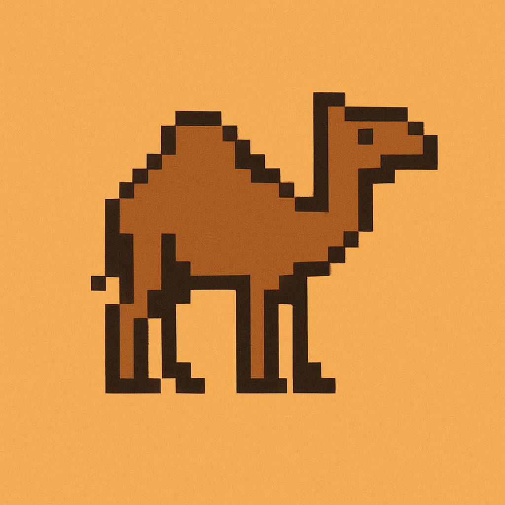

<div style="text-align:center;">
  
</div>

---

# Dromadaire

## Local dev

```bash
uv pip install -e .
uv run app
uv run ruff check
```

## Running app remotely

```bash
uvx --with git+https://github.com/callmephilip/dromadaire app
```
