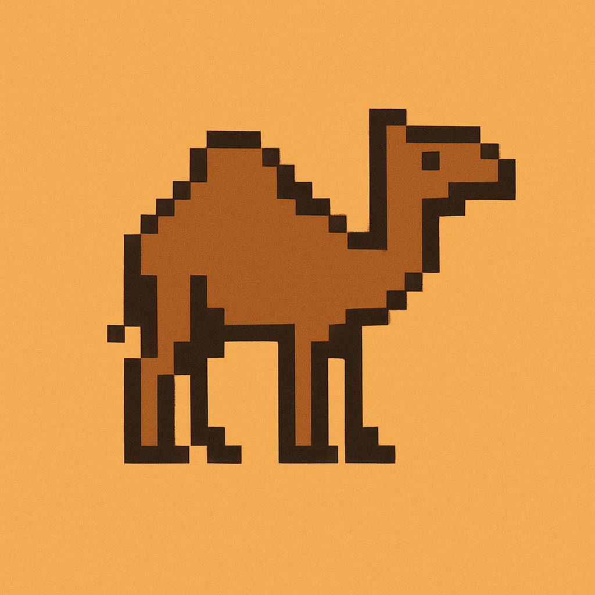

<div align="center">
  <a href="https://bsky.app/profile/callmephilip.com/post/3lsxyhrsyac2h">
    
  </a>
</div>

<h1 align="center">Dromadaire</h1>

1 hump is better than 2


## Local dev

```bash
uv pip install -e .
uv run app
uv run ruff check
```

Logs (open in a separate window): `textual console` while running `textual run --dev src/dromadaire/__main__.py`

Use claude in yolo mode with

```
./claude
```

## Testing

Update snapshot

```
pytest --snapshot-update
```

## Running app remotely

```bash
uvx --with git+https://github.com/callmephilip/dromadaire app
```

recommended [env settings](https://github.com/velodrome-finance/sugar-sdk/blob/superswaps/.env.example)

## Inspiration

- https://github.com/charles-001/dolphie
- https://github.com/tconbeer/harlequin